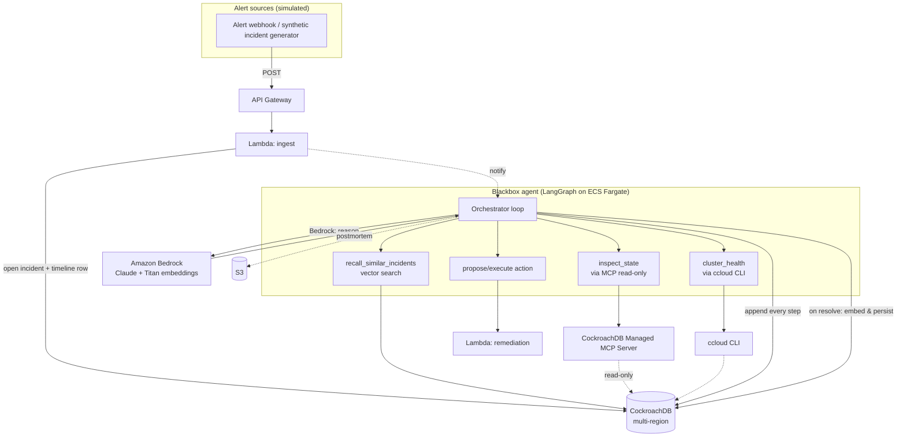

# Blackbox — the on-call copilot whose memory survives the outage

> **One-liner:** An SRE incident-response agent whose memory is a globally-distributed,
> always-on CockroachDB. Named after the flight recorder: the box that survives the crash
> and holds the memory of what happened. The agent that fixes outages cannot have memory
> that goes down *during* an outage — that is the entire thesis.

**Hackathon:** CockroachDB × AWS — Build with Agentic Memory
**Deadline:** 19 Aug 2026, 02:30 IST
**License:** Apache-2.0 (visible in repo About)

---

## 1. The pitch (what judges hear in 30 seconds)

Production agents write constantly and fail hard: when an agent's memory goes offline it
doesn't degrade, it *stops*. Blackbox is an on-call agent that triages real incidents, and
its memory — past incidents, runbooks, live incident timeline, and current system state —
lives in CockroachDB. When we kill a region mid-incident in the demo, Blackbox keeps
reasoning and its timeline stays intact and consistent. A single-region Postgres + pgvector
stack would stall or lose writes. **Memory survivability is the product, not a footnote.**

This maps 1:1 onto the rubric:

| Judging criterion | How Blackbox scores |
|---|---|
| Agentic Memory Design | 3 memory types (semantic recall, operational state, timeline) co-located, transactional |
| Technical Implementation | LangGraph agent, CRDB as checkpointer + vector store + system-of-record; MCP read-only; ccloud |
| Real-World Impact | On-call/incident response is a universal, expensive, high-stakes workflow |
| Production Readiness | Read-only MCP, audit logging, RBAC service accounts, multi-region survival, observability |
| Creativity & Originality | "Memory that survives the outage" — CRDB's differentiator *is* the demo |

---

## 2. Requirements coverage (the checklist)

**CockroachDB tools — using 3 of 4 (requirement is ≥2):**
- **Distributed Vector Indexing** — semantic recall of similar past incidents & runbooks. No
  separate vector store, no consistency gap with operational data.
- **Managed MCP Server** (`https://cockroachlabs.cloud/mcp`) — the agent introspects live
  system-of-record state in **read-only** mode with full audit logging. Safe by default.
- **ccloud CLI (agent-ready)** — a "cluster health / blast radius" tool the agent calls to
  check node & region status and audit logs; also drives the region-kill demo.
- *(Stretch: Agent Skills Repo for CRDB operational skills = 4/4.)*

**AWS services — using 2+ (requirement is ≥1):**
- **Amazon Bedrock** — reasoning model (Claude on Bedrock) + Titan/Cohere embeddings.
- **AWS Lambda** — serverless alert-ingest webhook + safe remediation executor.
- *(Stretch: S3 for postmortem artifacts, API Gateway for the webhook.)*

**Deliverables:**
- [ ] Public repo, Apache-2.0 license in About
- [ ] Functional demo URL
- [ ] <3 min YouTube/Vimeo video (the region-kill money shot)
- [ ] Writeup: which CRDB + AWS tools and *how the agent used them*
- [ ] Optional architecture diagram (included below)

---

## 3. Architecture



**The memory flywheel:** every resolved incident is embedded and written back as
`incident_memory`, so the agent gets smarter with each incident it handles. That write-back
is transactional and instantly queryable by the vector index — the "no consistency gap"
selling point in action.

---

## 4. Data model (CockroachDB)

Three memory layers, one database, one transaction boundary:

```sql
-- Operational state (system of record)
CREATE TABLE services (
  id UUID PRIMARY KEY DEFAULT gen_random_uuid(),
  name STRING NOT NULL,
  region STRING NOT NULL,
  depends_on UUID[]           -- dependency graph for blast-radius reasoning
);

CREATE TABLE incidents (
  id UUID PRIMARY KEY DEFAULT gen_random_uuid(),
  service_id UUID REFERENCES services(id),
  title STRING NOT NULL,
  severity INT NOT NULL,       -- SEV1..SEV4
  status STRING NOT NULL,      -- open | investigating | mitigated | resolved
  opened_at TIMESTAMPTZ DEFAULT now(),
  resolved_at TIMESTAMPTZ
);

-- Live timeline (append-only; the agent's working memory of THIS incident)
CREATE TABLE incident_events (
  id UUID PRIMARY KEY DEFAULT gen_random_uuid(),
  incident_id UUID REFERENCES incidents(id),
  ts TIMESTAMPTZ DEFAULT now(),
  actor STRING NOT NULL,       -- agent | human:<name>
  kind STRING NOT NULL,        -- hypothesis | action | observation | resolution
  content STRING NOT NULL
);

-- Semantic long-term memory (the recall store; the flywheel)
CREATE TABLE incident_memory (
  id UUID PRIMARY KEY DEFAULT gen_random_uuid(),
  incident_id UUID REFERENCES incidents(id),
  symptom_text STRING NOT NULL,
  symptom_embedding VECTOR(1024),   -- Titan Text Embeddings v2 = 1024 dims
  root_cause STRING,
  resolution STRING,
  created_at TIMESTAMPTZ DEFAULT now()
);

CREATE TABLE runbooks (
  id UUID PRIMARY KEY DEFAULT gen_random_uuid(),
  title STRING NOT NULL,
  body STRING NOT NULL,
  embedding VECTOR(1024)
);

-- Distributed vector indexes
CREATE VECTOR INDEX ON incident_memory (symptom_embedding);
CREATE VECTOR INDEX ON runbooks (embedding);
```

Recall query the agent runs:

```sql
SELECT incident_id, symptom_text, root_cause, resolution
FROM incident_memory
ORDER BY symptom_embedding <-> $1     -- $1 = embedded live symptom
LIMIT 5;
```

**LangGraph checkpointing:** point the LangGraph checkpointer at the same CRDB cluster so
the agent's *own graph state* also persists there. That means the agent process can die and
resume mid-incident with zero state loss — a second, deeper demonstration of survivable
agent memory beyond the domain data.

---

## 5. Agent design (LangGraph)

Nodes / tools:
1. `recall_similar_incidents(symptom)` → embed via Bedrock, vector search CRDB, return top-k.
2. `inspect_state(query)` → **via MCP server, read-only** — services, dependencies, open incidents.
3. `cluster_health()` → shells `ccloud cluster list --format json` / audit logs; reports node & region status.
4. `append_timeline(kind, content)` → transactional write to `incident_events`.
5. `propose_remediation()` → Bedrock reasons over recall + state → ranked runbook steps.
6. `execute_action(step)` → invokes a Lambda (gated: dry-run by default, human-approve for real actions → Production Readiness point).
7. `resolve(root_cause, resolution)` → close incident, embed symptom, write `incident_memory` (flywheel).

Guardrails (production-readiness story): MCP is read-only; writes go through typed tools with
validation; destructive remediation requires human approval; every agent step is an auditable
`incident_events` row; CRDB service accounts scoped with least-privilege RBAC.

---

## 6. The demo script (<3 min, this wins or loses it)

1. **0:00** — Fire a synthetic SEV1 (e.g. "checkout latency spike in us-east"). Show the incident open in CRDB.
2. **0:20** — Blackbox recalls a similar past incident via vector search; shows the match + its old resolution. *"It remembers."*
3. **0:45** — Blackbox inspects live state over MCP (read-only badge visible), maps blast radius via the dependency graph.
4. **1:10** — It posts a diagnosis + ranked runbook to the timeline; proposes a remediation (dry-run).
5. **1:30 — MONEY SHOT:** kill a region/node with `ccloud` mid-incident. The agent keeps reasoning; the timeline keeps appending; nothing is lost. Split-screen contrast: a single-node Postgres would have stalled.
6. **2:15** — Incident resolved → symptom embedded and written back as memory. Re-fire a similar alert → instant recall of *this* incident. The flywheel turns.
7. **2:45** — One-line close on the thesis.

---

## 7. Build plan (~14 days: today Aug 5 → Aug 19)

**Phase 0 — Foundations (Days 1–2)**
- Create CockroachDB Cloud cluster (multi-region serverless if available; else 3-node standard).
- Enable Managed MCP Server from Cloud Console; grab config snippet; create least-priv service account.
- AWS account: Bedrock model access (Claude + Titan Embeddings), IAM roles.
- Repo scaffold, Apache-2.0 license, README skeleton.

**Phase 1 — Memory layer (Days 3–5)**
- Schema + vector indexes; seed `services`, `runbooks`, and ~15 synthetic historical incidents with embeddings.
- Verify vector recall quality with a handful of test symptoms.
- Wire LangGraph checkpointer to CRDB.

**Phase 2 — Agent core (Days 6–9)**
- Implement the 7 tools; Bedrock reasoning loop; transactional timeline writes.
- MCP read-only introspection tool; ccloud `cluster_health` tool.
- Human-approval gate on remediation.

**Phase 3 — AWS wiring + deploy (Days 10–11)**
- Lambda ingest webhook + API Gateway; Lambda remediation executor (dry-run).
- Deploy agent to ECS Fargate (or Lambda if it fits); S3 postmortem artifacts.
- Public functional demo URL (a minimal web dashboard showing incident + timeline live).

**Phase 4 — Demo + survivability proof (Days 12–13)**
- Synthetic incident generator; scripted region-kill.
- Rehearse and record the <3 min video; capture the split-screen contrast.

**Phase 5 — Polish + submit (Day 14)**
- README: tool-by-tool writeup ("what did the agent actually do with them"), architecture diagram, setup/run steps.
- License visible in About; final submission on Devpost.

---

## 8. Stack summary

| Layer | Choice |
|---|---|
| Memory / DB | CockroachDB Cloud (multi-region) — vector + operational + LangGraph state |
| Agent framework | LangGraph (LangChain integration is CRDB-blessed) |
| Reasoning + embeddings | Amazon Bedrock (Claude + Titan Text Embeddings v2, 1024-dim) |
| Introspection | CockroachDB Managed MCP Server (read-only) |
| Control plane | ccloud CLI |
| Ingest / actions | AWS Lambda + API Gateway |
| Compute | ECS Fargate |
| Artifacts | Amazon S3 |
| Frontend (demo) | Minimal web dashboard (live timeline view) |

---

## 9. Risks & mitigations
- **Multi-region cluster cost/availability** → fall back to a 3-node single-region and simulate a node kill; the survivability story still lands.
- **Bedrock model access approval lag** → request Day 1; fall back to Anthropic API directly if Bedrock access stalls (keep Bedrock for embeddings to preserve the AWS requirement).
- **Scope creep** → the region-kill demo + vector recall + read-only MCP is the minimum winning core. Everything else (S3, Agent Skills, real remediation) is bonus.
